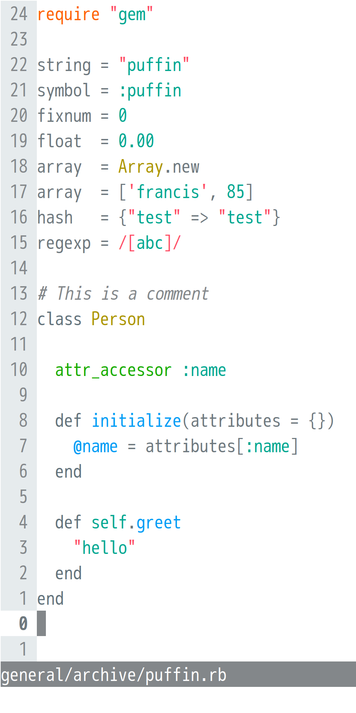

# seabird

A Vim theme based on hue 202 , a soothing blue of sea and sky. The light version is **seagull**; the dark, **petrel**. The high-contrast light theme is **puffin**.

Featuring gui (Linux/Windows GVim, MacVim, Neovim), terminal, and true (24-bit) colour support.

## screenshots

seagull | | petrel
-----------------------------------------------------------------------|------------|---------------
 | |
 <br> <br> <br> <br> <br> <br> <br>  |   |  <br> <br> <br> <br> <br> <br> <br> 
**puffin** | |
 <br> <br> <br> <br> <br> <br> <br>  | 

## installation

### step 1: download the colour scheme

#### option A: manually

Download `seagull.vim` and/or `petrel.vim` from this repository and place in directory `~/.vim/colors/` (Linux/Mac) or `%userprofile%\vimfiles\colors\` (Windows).

#### option B: using a plugin manager

For easy management of Vim colour schemes (and other plugins), try a plugin manager. With the [Vundle](https://github.com/VundleVim/Vundle.vim) plugin manager, for instance, just add `Plugin 'nightsense/seabird'` to the list of plugins in your `vimrc`, then run `VundleUpdate`. (To automatically keep plugins up to date with Vundle, add `vim +VundleUpdate +qall` to a startup script or cron job.)

### step 2: activate the colour scheme

Add `colorscheme seagull` or `colorscheme petrel` to your `vimrc`.

Or, if you'd like to switch automatically between them based on time of day, add this block (which activates petrel when launching Vim between 8PM and 8AM, seagull otherwise):

```
if strftime("%H") < 8 || strftime("%H") > 20
colorscheme petrel
else
colorscheme seagull
endif
```

### step 3: configure terminal colours (if using Vim in a terminal)

In order for seagull or petrel to work properly in terminal Vim, the terminal's colours should be set to match those of the active Vim theme.

As of now, this repository only provides one terminal configuration file: `Xresources`, which is used by two popular Linux terminals, xterm and urxvt. If you'd like to see a configuration file for another terminal, feel free to make a [request](https://github.com/nightsense/seabird/issues).

## how seabird took flight

### step 1: choose a principal hue

Hue 202  was chosen.

### step 2: choose base colours

The base colours were selecting using the hue/saturation/value model of colour definition.

First, all base colours were assigned hue 202.

Second, saturation levels were assigned. The lightest colour, **seagrey8**, was assigned 0. For the remaining colours, an excerpt of the Fibonacci sequence was applied.

base colour | basic role                       | hue ° | saturation %
------------|----------------------------------|-------|-------------
seagrey1    | regular background (petrel)      | 202   | 55
seagrey2    | highlighted background (petrel)  | 202   | 34
seagrey3    | subdued text (petrel)            | 202   | 21
seagrey4    | regular text (seagull)           | 202   | 13
seagrey5    | regular text (petrel)            | 202   | 8
seagrey6    | subdued text (seagull)           | 202   | 5
seagrey7    | highlighted background (seagull) | 202   | 3
seagrey8    | regular background (seagull)     | 202   | 0

Third, value levels were assigned. **seagrey8** was set to 100% value. The remaining colours were assigned values based on contrast ratios with other base colours.

this colour was assigned...                                                     | ...this hex... | ...due to this contrast ratio\*...         | ...with this colour
--------------------------------------------------------------------------------|----------------|--------------------------------------------|--------------------
 seagrey1 | 0c141a         | 18½:1                                      | seagrey8
 seagrey2 | 1d262b         | 1⅕:1                                       | seagrey1
 seagrey3 | 61717a         | 3:1                                        | seagrey2
 seagrey4 | 6d777d         | 4½:1                                       | seagrey8
 seagrey5 | 787e82         | 4½:1                                       | seagrey1
 seagrey6 | 83878a         | 3:1                                        | seagrey7
 seagrey7 | e6ebed         | 1⅕:1                                       | seagrey8
 seagrey8 | ffffff         | -                                          | -

- the 3:1 ratio ensures that subdued text on highlighted background meets the ISO-recommended ['standard minimum'](https://www.w3.org/TR/UNDERSTANDING-WCAG20/visual-audio-contrast-contrast.html#visual-audio-contrast-contrast-73-head) for readable text
- the 4½:1 ratio ensures that regular text on regular background meets the W3C-recommended ['accessible minimum'](https://www.w3.org/TR/UNDERSTANDING-WCAG20/visual-audio-contrast-contrast.html#visual-audio-contrast-contrast-73-head) for readable text

### step 3: choose seagull accent colours

Accent colour hues were selected from around the (30°-divided) colour wheel: hue 202 plus seven of its companions.

colour | hue
-------|----
red    | 352
orange | 22
yellow | 52
green  | 112
teal   | 172
blue   | 202
purple | 262
pink   | 322

The aesthetic aim of **seagull** included a bright, cheerful palette of accent colours. The contrast ratio of each hue was tuned accordingly. Each colour started with 100% value and saturation; contrast was adjusted by either lowering saturation (to lower contrast) or lowering value (to raise it).

While the ISO-recommended ['standard minimum'](https://www.w3.org/TR/UNDERSTANDING-WCAG20/visual-audio-contrast-contrast.html#visual-audio-contrast-contrast-73-head) contrast ratio for readable text is 3:1, this proved too high for most colours, leading to a relaxed minimum of 2¾:1. All hues were adjusted to this ratio except red and purple (the two highest-contrast hues), which needed a little extra to achieve the same vibrancy as the others.

seagull accent colour                                                         | hex      | contrast ratio\* | hue ° | saturation % | value %
------------------------------------------------------------------------------|----------|------------------|-------|--------------|--------
 red    | `ff596f` | 3                | 352   | 65           | 100
 orange | `ff711f` | 2¾               | 22    | 88           | 100
 yellow | `b39b00` | 2¾               | 52    | 100          | 70
 green  | `18b300` | 2¾               | 112   | 100          | 74
 teal   | `00ad96` | 2¾               | 172   | 100          | 68
 blue   | `00a2ff` | 2¾               | 202   | 100          | 100
 purple | `a470ff` | 3¼               | 262   | 56           | 100
 pink   | `ff5cc4` | 2¾               | 322   | 64           | 100

### step 4: choose puffin accent colours

For those who like the look of seagull but want proper, ISO-recommended readability, there's **puffin**, the high-contrast light theme.

puffin accent colour                                                          | hex      | contrast ratio\* | hue ° | saturation % | value %
------------------------------------------------------------------------------|----------|------------------|-------|--------------|--------
 red    | `ff4a62` | 3¼               | 352   | 71           | 100
 orange | `ff6105` | 3                | 22    | 98           | 100
 yellow | `ab9400` | 3                | 52    | 100          | 67
 green  | `17ab00` | 3                | 112   | 100          | 67
 teal   | `00a690` | 3                | 172   | 100          | 65
 blue   | `009bf5` | 3                | 202   | 100          | 96
 purple | `a069ff` | 3½               | 262   | 59           | 100
 pink   | `ff4abd` | 3                | 322   | 71           | 100

### step 5: choose petrel accent colours

The accent colours of the **petrel** theme were derived from the seagull colours by reducing saturation of all hues by ¼, then adjusting value to achieve 4½:1 contrast ratio\* (the W3C-recommended ['accessible minimum'](https://www.w3.org/TR/UNDERSTANDING-WCAG20/visual-audio-contrast-contrast.html#visual-audio-contrast-contrast-73-head) for readable text) with the petrel background. Against a dark background, this higher contrast ratio proved appropriate for all colours.

petrel accent colour                                                          | hex      | contrast ratio\* | hue ° | saturation % | value %
------------------------------------------------------------------------------|----------|------------------|-------|--------------|--------
 red    | `bd616d` | 4½               | 352   | 49           | 74
 orange | `b86b3f` | 4½               | 22    | 66           | 72
 yellow | `8c7e23` | 4½               | 52    | 75           | 55
 green  | `328f24` | 4½               | 112   | 75           | 56
 teal   | `238c7e` | 4½               | 172   | 75           | 55
 blue   | `2d85b8` | 4½               | 202   | 75           | 72
 purple | `8c6fbf` | 4½               | 262   | 42           | 75
 pink   | `b86098` | 4½               | 322   | 48           | 72

## notes

The seabird colour scheme files are generated by modifying those of the [flattened](https://github.com/romainl/flattened) colour scheme by Romain Lafourcade, which is in turn derived from the [Solarized](https://github.com/altercation/vim-colors-solarized) colour scheme by Ethan Schnoonover.

Colour adjustment was performed with the [GIMP](https://www.gimp.org/) colour selection tool. Contrast ratios were calculated with [these formulas](https://www.w3.org/TR/WCAG20-TECHS/G18.html#G18-tests).

\* minimum contrast; actual contrast may be slightly higher (due to discrete jumps in digital colour values)
