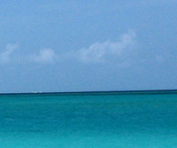
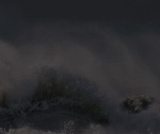
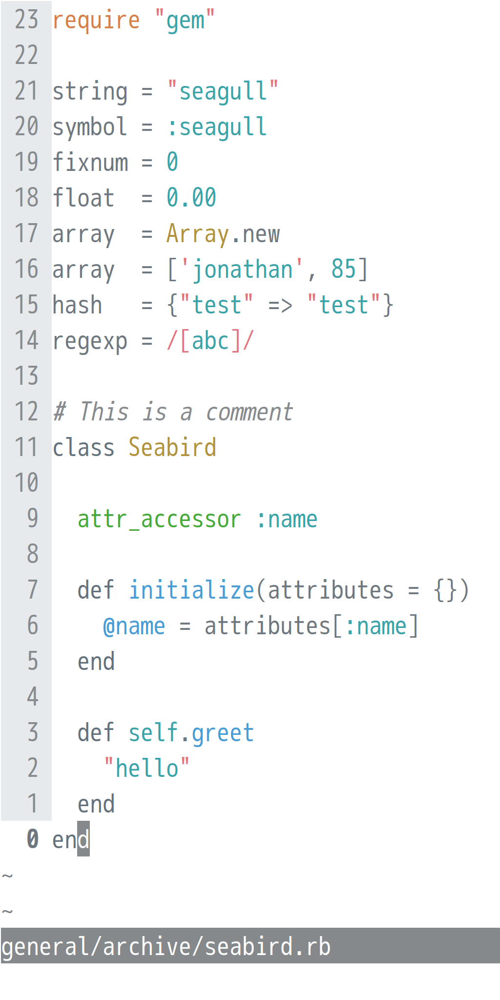
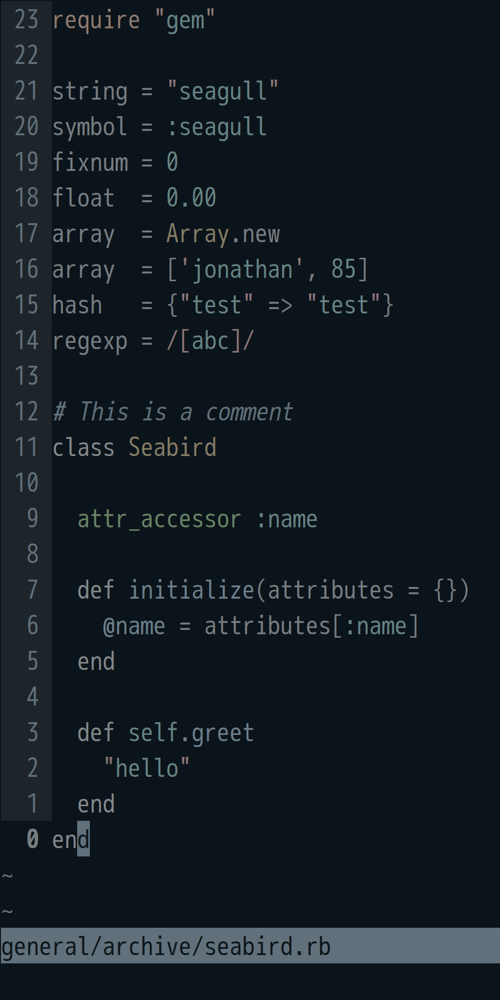
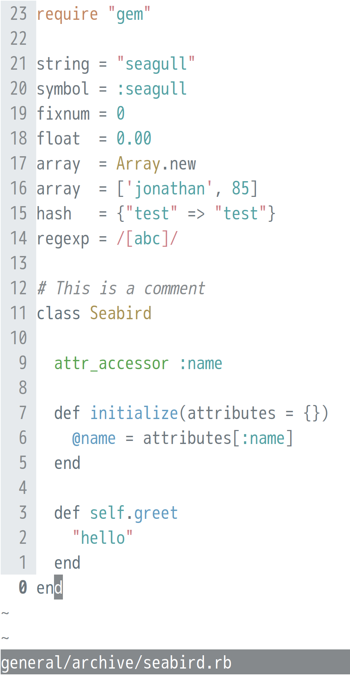
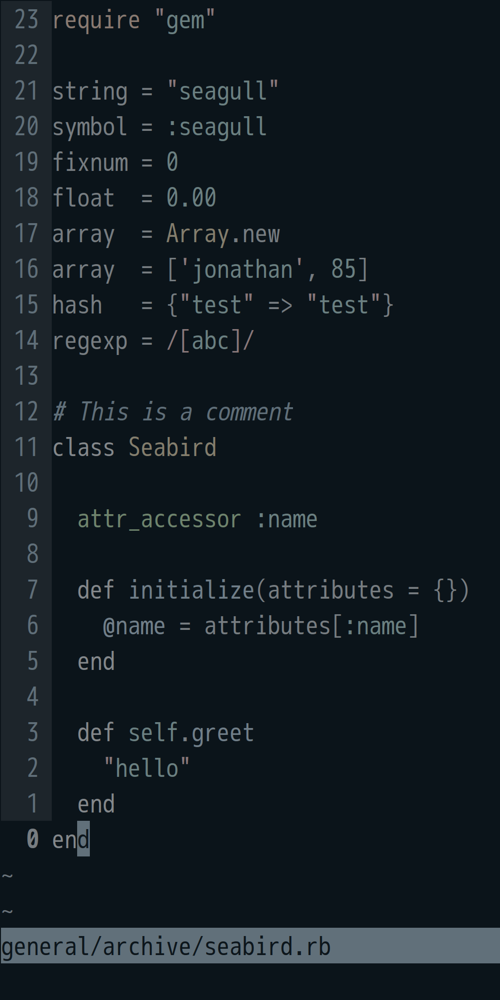

# seabird

- a Vim theme based on hue 204 
- gui (Linux/Windows GVim, MacVim, Neovim) + terminal + true (24-bit) colour
- six variants:

<table>
<tr>
<td></td>
<td align="center"> high-saturation</td>
<td align="center"> mid-saturation</td>
<td align="center"> low-saturation</td>
</tr>
<tr>
<td align="center"> light background</td>
<td align="center"><strong>seagull</strong></td>
<td align="center"><strong>rain gull</strong></td>
<td align="center"><strong>storm gull</strong></td>
</tr>
<tr>
<td align="center"> dark background</td>
<td align="center"><strong>petrel</strong></td>
<td align="center"><strong>rain petrel</strong></td>
<td align="center"><strong>storm petrel</strong></td>
</tr>
</table>

seabird is mathematically derived, largely through application of two widely-used [measures](https://www.w3.org/TR/UNDERSTANDING-WCAG20/visual-audio-contrast-contrast.html#visual-audio-contrast-contrast-73-head) of text-on-background readability: the ISO "standard" contrast ratio of 3:1, and the W3C "AA-rated accessible" contrast ratio of 4½:1.

## screenshots

<table>

<tr></tr><tr><td align="center"><h3>seagull</h3>
  
  
  
  
  
  
  
 </td>
<td align="center"> </td>
<td align="center"><h3>petrel</h3>
  
  
  
  
  
  
  
 </td></tr>

<tr></tr><tr><td align="center"><h3>rain gull</h3>
  
  
  
  
  
  
  
 </td>
<td align="center"> </td>
<td align="center"><h3>rain petrel</h3>
  
  
  
  
  
  
  
 </td></tr>

<tr></tr><tr><td align="center"><h3>storm gull</h3>
  
  
  
  
  
  
  
 </td>
<td align="center"> </td>
<td align="center"><h3>storm petrel</h3>
  
  
  
  
  
  
  
 </td></tr>

</table>

## installation

### step 1: download the colour scheme

#### option A: manually

Download the desired [colourscheme files](https://github.com/nightsense/seabird/tree/master/colors) and place in directory `~/.vim/colors/` (Linux/Mac) or `%userprofile%\vimfiles\colors\` (Windows).

#### option B: using a plugin manager

For easy management of Vim colour schemes (and other plugins), try a plugin manager. With the [Vundle](https://github.com/VundleVim/Vundle.vim) plugin manager, for instance, just add `Plugin 'nightsense/seabird'` to the list of plugins in your `vimrc`, then run `VundleUpdate`. (To automatically keep plugins up to date with Vundle, add `vim +VundleUpdate +qall` to a startup script or cron job.)

### step 2: activate the colour scheme

Add `colorscheme [theme name]` to your `vimrc` (e.g. `colorscheme seagull`).

To switch automatically between light and dark, try the [night-and-day](https://github.com/nightsense/night-and-day) plugin.

For Neovim, add `set termguicolors` to enable truecolour support.

### step 3: configure terminal colours (if using Vim in a terminal)

In order for seabird to work properly in terminal Vim, the terminal's colours should be set to match those of the active Vim theme.

As of now, this repository only provides one [terminal configuration file](https://github.com/nightsense/seabird/tree/master/terminal): `Xresources`, which is used by two popular Linux terminals, xterm and urxvt. If you'd like to see a configuration file for another terminal, feel free to make a [request](https://github.com/nightsense/seabird/issues).

## how seabird took flight

### step 1: choosing a principal hue

Hue 204  was chosen because:
- a sky blue colour was desired
- at 100% saturation and value, hue 204 features 3:1 contrast ratio (the ISO readability standard) with a white background

### step 2: choosing base colours

The base colours, which are shared by the light and dark versions of seabird, were selected using the hue/saturation/value model of colour definition.

First, all base colours were assigned hue 204.

Second, saturation levels were assigned. The lightest colour, seagrey8, was assigned 0. For the remaining colours, an excerpt of the Fibonacci sequence was applied.

base colour | role                             | hue ° | saturation %
:----------:|:--------------------------------:|:-----:|:-----------:
seagrey1    | regular background (petrel)      | 204   | 55
seagrey2    | highlighted background (petrel)  | 204   | 34
seagrey3    | subdued text (petrel)            | 204   | 21
seagrey4    | regular text (seagull)           | 204   | 13
seagrey5    | regular text (petrel)            | 204   | 8
seagrey6    | subdued text (seagull)           | 204   | 5
seagrey7    | highlighted background (seagull) | 204   | 3
seagrey8    | regular background (seagull)     | 204   | 0

Third, value levels were assigned. seagrey8 was set to 100% value. The rest were assigned values based on contrast ratios with other base colours.

this colour was assigned... | ...this value... | ...to meet this contrast ratio...          | ...with this colour
:--------------------------:|:----------------:|:------------------------------------------:|:------------------:
seagrey1                    | 10               | 18½:1                                      | seagrey8
seagrey2                    | 17               | 1⅕:1                                       | seagrey1
seagrey3                    | 48               | 3:1                                        | seagrey2
seagrey4                    | 49               | 4½:1                                       | seagrey8
seagrey5                    | 51               | 4½:1                                       | seagrey1
seagrey6                    | 55               | 3:1                                        | seagrey7
seagrey7                    | 93               | 1⅕:1                                       | seagrey8
seagrey8                    | 100              | -                                          | -

- the 18½:1 ratio ensures a 10% value background for the dark theme: a "soft black" good for long-term readability
- the 1⅕:1 ratio provides background highlights that stand out clearly from the regular background
- the 3:1 ratio ensures that subdued text on highlighted background is ISO "standard" readable
- the 4½:1 ratio ensures that regular text on regular background is W3C "AA accessible" readable

The resulting colours:

seabird base colour                                                             | hex      | hue ° | saturation % | value %
:-------------------------------------------------------------------------------|:--------:|:-----:|:------------:|:------:
 seagrey1 | `0b141a` | 204   | 55           | 10
 seagrey2 | `1d252b` | 204   | 34           | 17
 seagrey3 | `61707a` | 204   | 21           | 48
 seagrey4 | `6d767d` | 204   | 13           | 49
 seagrey5 | `787e82` | 204   | 8            | 51
 seagrey6 | `85898c` | 204   | 5            | 55
 seagrey7 | `e6eaed` | 204   | 3            | 93
 seagrey8 | `ffffff` | 204   | 0            | 100

### step 3: choosing seagull accent colours

Accent colour hues were selected from around the (30°-divided) colour wheel: hue 204 plus seven companions.

hue    | contrast level | hue °
:-----:|:--------------:|:----:
red    | high           | 354°
orange | medium         | 24°
yellow | low            | 54°
green  | low            | 114°
teal   | low            | 174°
blue   | medium         | 204°
purple | high           | 264°
pink   | high           | 324°

All hues were initially set to 100% saturation and value. Then:

  - the low-contrast colours were reduced in value (**yellow** by ¼, **green** and **teal** by ⅓)
- the high-contrast colours were reduced in saturation (**red** by ¼, **purple** and **pink** by ⅓)
  - the mid-contrast colours (**orange** and **blue**) were left alone

  The goal contrast ratio was 3:1 (the ISO minimum). Where necessary, small hue adjustments were made to reach this standard.

  seagull accent colour                                                         | hex      | hue ° | saturation % | value %
  :-----------------------------------------------------------------------------|:--------:|:-----:|:------------:|:------:
   red    | `ff4053` | 354   | 75           | 100
   orange | `ff6200` | 23    | 100          | 100
   yellow | `bf8c00` | 44    | 100          | 75
   green  | `11ab00` | 114   | 100          | 67
   teal   | `00a5ab` | 182   | 100          | 67
   blue   | `0099ff` | 204   | 100          | 100
   purple | `9854ff` | 264   | 67           | 100
   pink   | `ff549b` | 335   | 67           | 100

  For rain gull, each seagull accent colour was reduced in saturation by ⅓, then reduced in value to a contrast ratio of 3:1.

  rain gull accent colour                                                       | hex      | hue ° | saturation % | value %
  :-----------------------------------------------------------------------------|:--------:|:-----:|:------------:|:------:
   red    | `e3717d` | 354   | 50           | 89
   orange | `d67e47` | 23    | 67           | 84
   yellow | `b0913a` | 44    | 67           | 69
   green  | `43a838` | 114   | 67           | 66
   teal   | `37a2a6` | 182   | 67           | 65
   blue   | `469bd4` | 204   | 67           | 83
   purple | `a980e8` | 264   | 45           | 91
   pink   | `d6769e` | 335   | 45           | 84

  For storm gull, each rain gull accent colour was reduced in saturation by ⅓, then reduced in value to a contrast ratio of 3:1.

  storm gull accent colour                                                      | hex      | hue ° | saturation % | value %
  :-----------------------------------------------------------------------------|:--------:|:-----:|:------------:|:------:
   red    | `c28288` | 354   | 33           | 76
   orange | `bd896a` | 23    | 44           | 74
   yellow | `a6935d` | 44    | 44           | 65
   green  | `62a35b` | 114   | 44           | 64
   teal   | `5a9ea1` | 182   | 44           | 63
   blue   | `6899ba` | 204   | 44           | 73
   purple | `a189c4` | 264   | 30           | 77
   pink   | `bd849c` | 335   | 30           | 74

### step 4: choosing petrel accent colours

  For petrel, each storm gull accent colour was reduced in value to a contrast ratio of 4½:1 (the W3C AA minimum).

  petrel accent colour                                                          | hex      | hue ° | saturation % | value %
  :-----------------------------------------------------------------------------|:--------:|:-----:|:------------:|:------:
   red    | `a66f75` | 354   | 33           | 65
   orange | `a1755a` | 23    | 44           | 63
   yellow | `8c7c4f` | 44    | 44           | 55
   green  | `538a4d` | 114   | 44           | 54
   teal   | `4d888a` | 182   | 44           | 54
   blue   | `59829e` | 204   | 44           | 62
   purple | `8874a6` | 264   | 30           | 65
   pink   | `a17085` | 335   | 30           | 63

  For rain petrel, each petrel accent colour was reduced in saturation by ⅓, then reduced in value to a contrast ratio of 4½:1.

  rain petrel accent colour                                                     | hex      | hue ° | saturation % | value %
  :-----------------------------------------------------------------------------|:--------:|:-----:|:------------:|:------:
   red    | `967579` | 354   | 22           | 59
   orange | `947968` | 23    | 30           | 56
   yellow | `877c5f` | 44    | 30           | 52
   green  | `63875f` | 114   | 30           | 53
   teal   | `5f8687` | 182   | 30           | 53
   blue   | `688294` | 204   | 30           | 58
   purple | `847896` | 264   | 20           | 59
   pink   | `947683` | 335   | 20           | 58

  For storm petrel, each petrel accent colour was reduced in saturation by ½, then reduced in value to a contrast ratio of 4½:1.

  storm petrel accent colour                                                    | hex      | hue ° | saturation % | value %
  :-----------------------------------------------------------------------------|:--------:|:-----:|:------------:|:------:
   red    | `8f797c` | 354   | 15           | 56
   orange | `8c7b70` | 23    | 20           | 55
   yellow | `857e6a` | 44    | 20           | 52
   green  | `6d856a` | 114   | 20           | 52
   teal   | `6a8485` | 182   | 20           | 52
   blue   | `70818c` | 204   | 20           | 55
   purple | `817a8c` | 264   | 13           | 55
   pink   | `8c7a82` | 335   | 13           | 55

## notes

  The seabird colour scheme files are generated by modifying those of the [flattened](https://github.com/romainl/flattened) colour scheme by Romain Lafourcade, which is in turn derived from the [Solarized](https://github.com/altercation/vim-colors-solarized) colour scheme by Ethan Schnoonover.

  Colour adjustment was performed with the [GIMP](https://www.gimp.org/) colour selection tool. Contrast ratios were calculated with [these formulas](https://www.w3.org/TR/WCAG20-TECHS/G18.html#G18-tests).

  Actual contrast ratios may be slightly higher than those listed, due to discrete jumps in digital colour values.

  Photo credits:
  - seagull by [Dan Hurt](https://www.flickr.com/photos/57549136@N02/6031726894), petrel by [Duncan (angrysunbird)](https://www.flickr.com/photos/11056712@N00/5291996898); both licensed [CC BY-SA 2.0](https://creativecommons.org/licenses/by-sa/2.0/).
  - 'clear sea' by [Ali West](https://www.flickr.com/photos/71539256@N00/639714927), 'rainy sea' by [Mary (puzzlement)](https://www.flickr.com/photos/99735090@N00/4123554458), 'stormy sea' by [Ingrid Taylar](https://www.flickr.com/photos/49503118795@N01/4266670427); all licensed [CC BY 2.0](https://creativecommons.org/licenses/by/2.0/), all colour-adjusted
